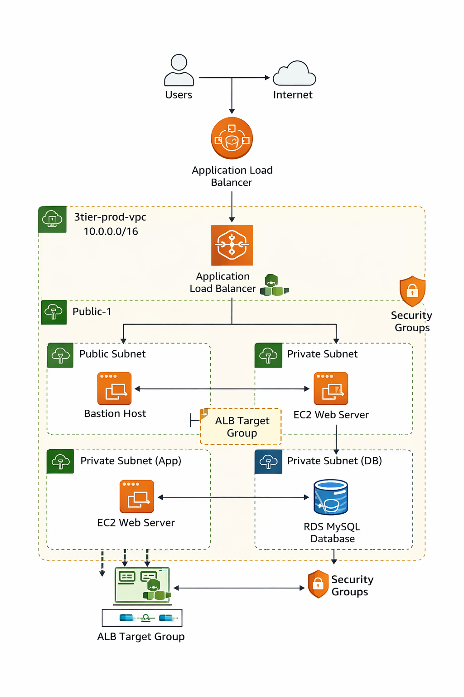

# AWS 3-Tier Architecture (Production Style)

---

## Project Overview

This project demonstrates a **production-style AWS 3-tier architecture** designed for high availability, security, and scalability.

The infrastructure separates the application into three logical layers:

1. **Presentation Layer** – Application Load Balancer
2. **Application Layer** – EC2 Web Server
3. **Data Layer** – Amazon RDS MySQL

---

## Architecture Diagram

---

## Architecture Components

### 1. VPC Networking

- Custom VPC
- CIDR: `10.0.0.0/16`
- Public Subnets
- Private Subnets
- Internet Gateway
- Route Tables

---

### 2. Security Layer

Security Groups enforce **least-privilege access**:

| Security Group | Purpose |
|----------------|--------|
| bastion-sg | SSH access |
| alb-sg | Internet → Load Balancer |
| web-sg | ALB → Web Server |
| rds-sg | Web Server → Database |

---

### 3. Compute Layer

EC2 instances deployed:

| Instance | Role |
|--------|------|
| Bastion Host | Secure SSH access |
| Web Server | Application server |

---

### 4. Load Balancing Layer

Application Load Balancer distributes traffic across web servers.

Features:

- HTTP listener
- Target Group
- Health checks

---

### 5. Database Layer

Amazon RDS MySQL deployed in a private subnet.

Features:

- db.t3.micro instance
- Private network access
- Secure security group rules

---
## Request Flow

User → Internet → Application Load Balancer → EC2 Web Server → RDS MySQL Database

## AWS Services Used

- Amazon VPC
- EC2
- Application Load Balancer
- Amazon RDS
- Security Groups
- Route Tables
- Internet Gateway

---

## Deployment Steps

Detailed deployment steps are available in:
