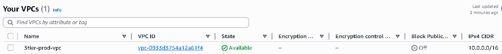
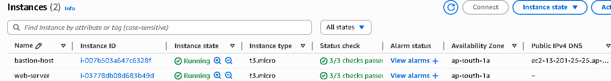
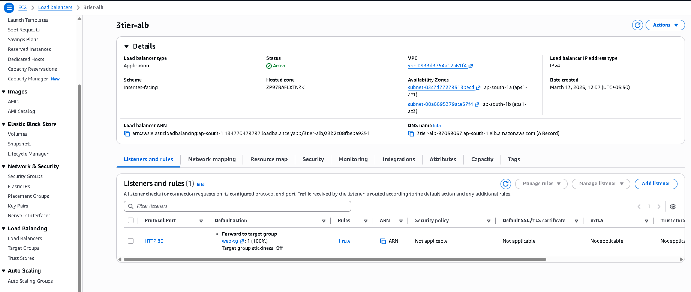
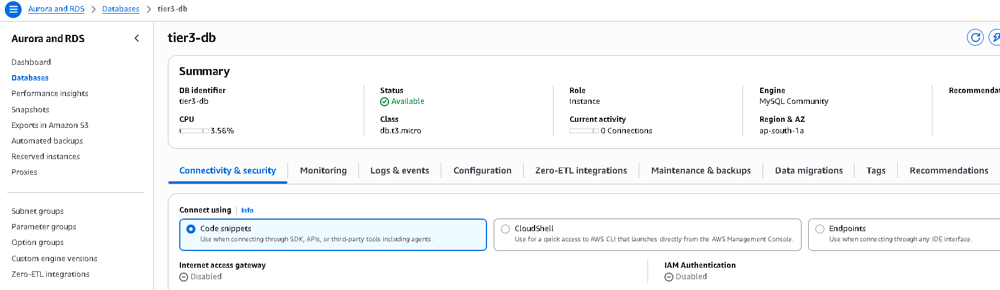

---

## Screenshots

### VPC

### EC2 Instances

### Load Balancer

### RDS Database

---

## Skills Demonstrated

- AWS VPC Networking
- Public / Private subnet architecture
- Bastion host access
- Application Load Balancer configuration
- EC2 deployment
- RDS database setup
- Secure infrastructure design

---

## Future Improvements

- Auto Scaling Group
- CI/CD Pipeline
- Infrastructure as Code (Terraform)
- Monitoring with CloudWatch

---
